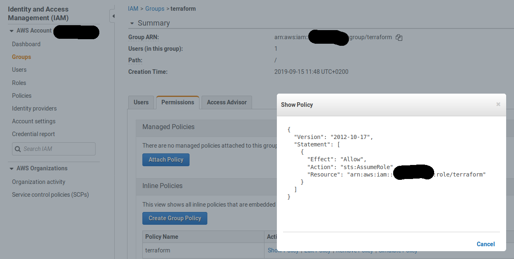

# Bootstrapping a secure AWS terraform environment #

## IAM ##

Securing the IAM user that runs terraform is the first step into hardening
terraform operations.

To bootstrap you need an AWS profile of a AWS user with the necessary permissions (policies attached) and
programmatic access enabled.

### The terraform role ###

An AWS role does not have any explicit access keys associated.
This idea is the starting point of securing AWS command-line based operations,
whatever tool needs credentials, terraform, aws cli, chamber, python boto,...

The terraform role is virtually unlimited in what it is allowed to do.
This can be equivalent to a full AWS administrator or some specific - services based - set of permissions,
depending on your use case and/or team/corporate policy.

This is described in the terraform role policy. Here we allow all actions on all resources. If you want to
use terraform without too much hassle you have to give it a lot of permissions to get the job done.
In the end you trust the people doing it, but do not trust leaking credentials, what is the goal of this whole endeavour.

Who can assume the role is determined by the terraform role trust policy, by describing
the principals (users, other roles, ...) that can assume the role and extra security measure like mandatory MFA and limited session duration.

### The terraform group and users ###

A terraform user is part of the terraform group, which has a policy it can only
assume the terraform role.

## State and secrets management ##

Keeping terraforms state on your device and/or in a source control system is a bad idea for a couple of reasons.
(even if you work completely ALONE)

- you don't have any concurrency control and you end up having multiple state files spread on the devices of the different terraform operators, with the associated headaches - even if you work alone (think multiple workstations!)
- secrets are stored in plain text into the terraform state, this argument alone should refrain you from keeping the state on your local device and/or in associated source control repository.

## State and secrets solution ##

Multiple solutions can be engineered. I will propose a simple but safe strategy.

### State ###

To bootstrap, initially keep the state on your local device, but don't commit it to source control.
Add it to .gitignore (or other ignore system) so you don't accidentally commit and push it to your repository.

After bootstrapping, you change the terraform state backend to the secure location and delete your local state.

For state management, encrypted S3 buckets are used. One for the bootstrap state (and one for the actual terraform state of the resources you want to create).

After adding the bootstrap bucket you can enable the s3 backend for the state in main.tf.  After running a terraform init, you will be asked to upload your current local state to the bucket, accept it.  

### Secrets ###

Don't use secret variables in a (.tfvars) file on your development device, eventually, you end up with potentially tons of secrets that can be compromised if your device gets stolen or compromised.
If you are running a production terraform environment, the headaches and labor associated with getting compromised secrets revoked - if at all possible (think database passwords in a running production system) - should give you enough incentive to do it properly.

#### AWS parameter store KMS key and alias ####

This is implemented in the `secure-secrets` module.
The `chamber` command line tool will be used to manage the secrets.
See <https://github.com/segmentio/chamber>.
As you will read you need to set a CHAMBER_KMS_KEY_ALIAS environment variable which we will create through terraform.
Chamber uses SecureString as parameter value type so we need a KMS key to encrypt/decrypt. KMS is the Key Management Service.
We will create a new KMS key for this purpose and an alias to be used by chamber.

## Console verifications ##

Check the terraform creation of the buckets, user(s), group and role and associated policies.

In my case:

The S3 buckets:


The terraform group policy:



The trust policy:


The dynamo db table:


## Creating access keys for the terraform user ##

This is the easiest through the AWS console.
But it can be done through the aws cli:

for example in my case:

`aws iam create-access-key --user-name martin.rosselle.terraform`

As a result you get:


Now you can create the profile with:

`aws configure --profile martin.rosselle.terraform`

You will be prompted to enter the key id and secret from previous step + default region.


## Enable MFA for the terraform user ##

At last we enable MFA for this user.  This is defnitely the easiest through the AWS console:


but it can be done through the aws cli also.

In my case I guide you through the steps with the aws cli:

`aws iam create-virtual-mfa-device --virtual-mfa-device-name martin.rosselle.terraform --outfile qrcode.martin.rosselle.terraform.png --bootstrap-method QRCodePNG`

This will give you a QR code file you can scan with google authenticator/authy/... and the the serial number on the shell:

```json
{
    "VirtualMFADevice": {
        "SerialNumber": "arn:aws:iam::************:mfa/martin.rosselle.terraform"
    }
}
```

and you pass the consequent 2 otp values from the scanned qr code into the next command using the serial number of the mfa device you just received.

`aws iam enable-mfa-device --user-name martin.rosselle.terraform --serial-number arn:aws:iam::**********:mfa/martin.rosselle.terraform --authentication-code1 <value> --authentication-code2 <value>`

At this point you should have an aws profile that can assume the terraform role with a maximum duration in seconds of 3600 or 1 hour and which is protected by a time based one time password (TOTP).

## Session activation ##

Now we have the AWS profile configured with corresponding MFA device, we want to use it for our tools that rely on this profile.
For the aws cli there is a mechanism that challenges for the MFA code by configuring an extra profile.  See AWS docs at <https://docs.aws.amazon.com/cli/latest/userguide/cli-configure-role.html>.
This is certainly an option for the aws cli but it has the drawback that cached credentials are created in ~/.aws/cli/cache.

I will take a different approach where the temporary credentials are only valid in the current shell through environment variables by using an activation script that can be sourced.

`source activate` and `deactivate` starts and stops your (client side) session.

### How it works ###

Have a look at the activation script.  The `aws sts assume-role` is the core of the thing.
It returns the necessary credentials that you can export into environment variables, remember AWS_ACCESS... and AWS_SESSION_.. environment credentials take precedence over the AWS_PROFILE environment variable. A simple deactivation function unsets them so they don't leak further when you are (prematurely) done with your job.

### Extra hardening ###

One step beyond...
Revoking the session on the server when you are done.  In our paranoia we could assume that our shell gets hijacked while we are busy and the session tokens get stolen.  Simply unsetting the environment variables on the client side doesn't revoke them on the server side.

Luckily, we can revoke them ourselves by adding some extra policy statement to the terraform group policy.

Of course we don't want to be able to revoke other sessions (unless you are admin/privileged).

To come...

## Chamber ##

Export .tfvar secret variables to the AWS system manager parameter store, and delete them from your device.
See the chamber documentation.

When you need the secrets you can fetch them with chamber and export them as environment variables before calling `terraform` or other tool like `terragrunt` that understand the TF_VAR...  convention.

For TF_VAR environment variables see the terraform documentation.

A simple but effective approach was given by this guy:  <https://github.com/segmentio/chamber/issues/117>  which i.e. wraps your call to whatever command (terraform, terragrunt) by first injecting the terraform (secret) variables into TF_VAR_ environment variables. Simple but effective!

You can use the idea in bash, python, ...
